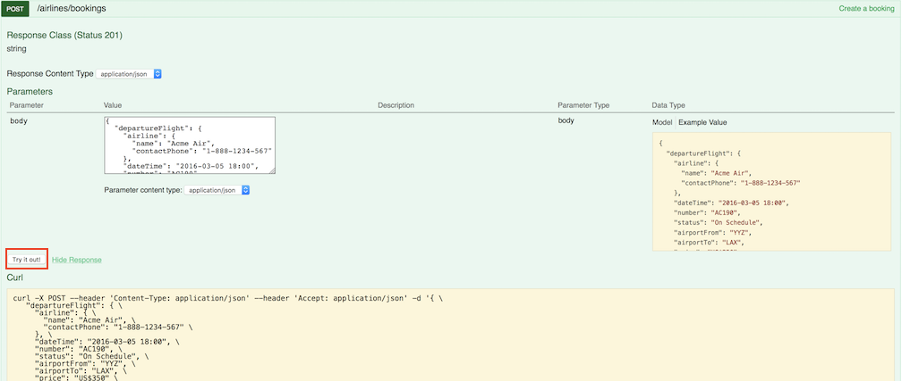
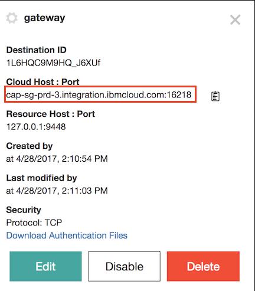
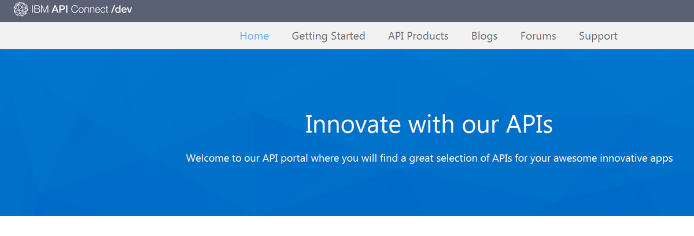
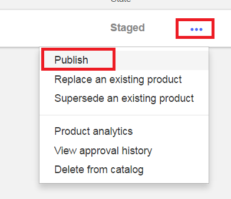

[](https://travis-ci.org/IBM/hybrid-connectivity)


# Extend your on-premise applications and services to public cloud, and vice versa

A hybrid cloud model blends elements of both the private and the public cloud, and gives users choice and flexibility to run apps and services across on-premises systems and the cloud. In the simplest terms, the hybrid model is primarily a private cloud that allows an organization to tap into a public cloud when and where it makes sense. This code shows you how to expose your on-premise applications and services to public cloud, and vice versa.

We first deploy an on-premise application and database on local machine. This simulates an on-prem environment behind a firewall. Thereafter we leverage public cloud services to create a  secure tunnel and expose the application APIs. Moving beyond, we show how the on-prem application can leverage public cloud application services. 

You learn the end-to-end process, starting with building your application server and database docker images leveraging WebSphere Liberty and CouchDB, deploying the sample Airline application and creating a Secure Gateway and setting up the API Connect service on IBM Bluemix to expose your application APIs. We then show how we can leverage our publi Weather service API on Bluemix to tie into the on-premise airline application.

In the second scenario, we move the sample Airline application to public Bluemix, and then show how your application running on public cloud can acccess your on-premise resources like database etc.

## Included Components

- [WebSphere Liberty](https://developer.ibm.com/wasdev/websphere-liberty/)
- [API Connect](http://www-03.ibm.com/software/products/en/api-connect)
- [Secure Gateway](https://console.ng.bluemix.net/docs/services/SecureGateway/sg_overview.html)
- [Insights for Weather](https://console.ng.bluemix.net/docs/services/Weather/weather_overview.html#about_weather)

## Scenarios

- Scenario One: **[Application and Database On-Premise, consuming a Public Cloud service](#steps)**
- Scenario Two: **[Database On-Premise, Application and service on Public Cloud ](on-promise-database.md)**

## Steps
1. [Build Your Sample Airline API Application](#1-build-sample-airline-api-application)
2. [Run the Application and Database on-premise using WebSphere, CouchDB and Docker](#2-run-the-application-and-database-on-premise-using-docker)
3. [Create a Tunnel to expose your On-promise APIs](#3-create-a-tunnel-to-expose-your-on-promise-apis)
4. [Create an API Connect service in Bluemix](#4-create-an-api-connect-service-in-bluemix)
5. [Integrate WebSphere Liberty and API Connect: push and pull](#5-integrate-websphere-liberty-and-api-connect-push-and-pull)
- 5.1 [Push WebSphere Liberty APIs into API Connect](#51-push-websphere-liberty-apis-into-api-connect)
- 5.2 [Pull WebSphere Liberty APIs from API Connect](#52-pull-websphere-liberty-apis-from-api-connect)

[Troubleshooting](#troubleshooting)


# 1. Build sample Airline API Application

Our sample Airline API application is an airline booking application that demonstrates how API application can store its data using on-promise database and enhance its API features using Bluemix's Data Analytic Service.

In this step, we will add our own Weather API credential for the application and build a .war file using Maven. The Weather API will provide the weather condition for destination airports selected by clients. 

1. First, install [Maven](https://maven.apache.org/install.html) to build and package our application into *.war* format.


2. Create [Weather API service](https://console.ng.bluemix.net/catalog/services/weather-company-data?taxonomyNavigation=data) in Bluemix. 

3. Go to your **Service credentials** and mark down your username and password. Then go to **flight-booking/src/main/java/microservices/api/sample** folder (`cd flight-booking/src/main/java/microservices/api/sample`). Now, add your username and password credential in the **DatabaseAccess.java** file.

	

4. Go to the **flight-booking** folder, run `mvn package` to build the .war file.


5. Go to the **deployment_artifacts** folder and move your **airlines.war** file to your main directory's **airline_app/apps** folder.


# 2. Run the Application and Database on-premise using WebSphere, CouchDB and Docker

In this step we will build our application server docker image with run it on docker. In this example, we will use WebSphere Liberty for our server. We will also deploy a local CouchDB database

At the end of this step, you should able to call your application APIs via localhost. 

1. Install [Docker CLI](https://www.docker.com/community-edition#/download).

2. To deploy the Airline API application, put the **.war** file in **airline_app/apps** folder and configure the **server.xml** file. For this example, we are using airlines API application, but you can also add your own application.

	In this main directory, build your server and run it on your local host.

    ```bash
   	docker build -t hybrid/airlines .
    docker-compose up
    ```
   	Now you current terminal will execute all the logs from your app.
    
    If you are running with our example app, after you have your server and database running, run the following commands to initiate couchDB.
    
    ```bash
    bash database_init.sh
    ```

3. To reach the WebSphere Liberty API Discovery user interface, go to `https://localhost:9443/ibm/api/explorer`. Since docker only exposes tcp port and api-connect is using https port, we need to authenticate the website. Then, use the credentials from your server.xml to login (For this example, the **username** is `admin` and the **password** is `admin`).

	You should see something like this in your API Discovery user interface.

	

4. As shown in the following screen capture, you can click the **Try it out** button, which starts the sample Airline application, running on Docker

	
    
    
# 3. Create a Tunnel to expose your On-promise APIs

In this step, we will use the secure gateway as our tunnel to expose our APIs to the cloud host. At the end of this step, you should able to access and call your localhost APIs on any device via cloud host.

1. First, create your [secure gateway service](https://console.ng.bluemix.net/catalog/services/secure-gateway?taxonomyNavigation=apis) from bluemix.

2. Then, follow this [Getting started with the Secure Gateway](https://console.ng.bluemix.net/docs/services/SecureGateway/secure_gateway.html) tutorial to setup your gateway.

3. When you setup your secure gateway client, install **IBM Installer** and run it on your local machine.

	
    
4. After you open the secure gateway client with your Gateway ID and Security Token, click enter and run the following commands.

	```
    acl allow 127.0.0.1:9443
    ```

	Now your Gateway is able to access your API Discovery Server.

5. Now let's create the destination for our gateway. First, select **On-Premises** at Guided Setup and click next. 

	
    
6. Next, put down **127.0.0.1** for your resource hostname and **9443** for your port and click next.

	
    
7. Next, select **TCP** for your protocol and click next. Then, select **None** for your authentication and click next. Then, do not put anything on your IP table rules. Lastly, name your destination and click **Add Destination**.


8. Now, you can access your API Discovery Server via the secure gateway cloud host. You can view your cloud host by clicking on the **gear icon** on your destination. 

	


9. Now, go to `https://<Cloud Host:Port>/ibm/api/explorer/` and varify the secure gateway is working. Remember, your default username is **admin** and password is **admin**. 


# 4. Create an API Connect service in Bluemix

In this step, we will setup API Connect service to help us distribute our APIs.

1. To add API Connect as a Bluemix service, go to the bluemix [API Connect service](https://console.ng.bluemix.net/catalog/services/api-connect?taxonomyNavigation=services)


2. Then, select the **Essentials plan** and click **Create**.

3. Go to dashboard by clicking here

	

4. By default, an empty catalog called **Sandbox** is created. To enable its corresponding developer portal, click **Sandbox** then **Settings**.

5. Click **Portal**, and then under **Portal Configuration**, select **IBM Developer Portal**. A Portal URL is automatically inserted.

6. Take note of the Portal URL, which reveals the target server address and organization that you need later. The URL is broken down into the following three parts, as shown in the following screen capture: 

	

    - 1 is the catalog's short name, in this case, sb.
    - 2 is your organization ID, in the example, arthurdmcaibmcom-dev.
    - 3 is the target address of your API Connect instance, for example, https://us.apiconnect.ibmcloud.com. 

7. Click Save at the top right corner. You see the following message:

    `
    Creating the developer portal for catalog 'Sandbox' may take a few minutes. You will receive an email when the portal is available.
    `

8. After you received the email, go to the **Portal URL** and you will see something like this.

	

	This is where enterprise developers go to find the products (for example, an API or a group of APIs) that are exposed in the API catalog. Developers also can interact with each other through the Blogs and Forums links.

# 5. Integrate WebSphere Liberty and API Connect: push and pull
> Choose either [push](#41-push-websphere-liberty-apis-into-api-connect) or [pull](#42-pull-websphere-liberty-apis-from-api-connect) WebSphere Liberty APIs from API Connect. Also, push won't work on IBMer's account due to federated reasons.

## 5.1 Push WebSphere Liberty APIs into API Connect

In this step, we will learn about how to use the post request on API discovery to push our APIs into API Connect.

1. Go to `https://<Cloud Host:Port>/ibm/api/explorer/`

2. Click **POST** for the apiconnect endpoint

	

3. Fill in the parameters as shown in the following screen capture, your organization ID should be the second part of your Portal URL.

	

4. You want to publish this API product, not just stage it, so leave the stageOnly parameter as false. The X-APIM-Authorization parameter represents the credentials that Liberty uses to log into API Connect. The description on the right side provides details on the accepted format. The following example uses: apimanager/arthurdm@ca.ibm.com:myPassword.

	

5. Since we are running our APIs on our local machine, we do not want to use the sample JSON file because that will set the APIs target URL to our local machine. Instead, we want to change the `<cloud host:port>` part in **target-url** (line 38) from the following JSON file (you can also get it from the **discovery-post.json** file) to your cloud host : port (e.g. `"https://cap-sg-prd-1.integration.ibmcloud.com:16218$(request.path)"`). Then copy and paste it into the body input box.
	```JSON
	{
	  "product": "1.0.0",
	  "info": {
	    "name": "pushed-product",
	    "title": "A Product that encapsulates Liberty APIs",
	    "version": "1.0.0"
	  },
	  "visibility": {
	    "view": {
	      "enabled": true,
	      "type": "public",
	      "tags": [
	        "string"
	      ],
	      "orgs": [
	        "string"
	      ]
	    },
	    "subscribe": {
	      "enabled": true,
	      "type": "authenticated",
	      "tags": [
	        "string"
	      ],
	      "orgs": [
	        "string"
	      ]
	    }
	  },
	  "apis": {
	    "liberty": {
	      "name": "liberty-api:1.0.0",
	      "x-ibm-configuration": {
	        "assembly": {
	          "execute": [
	            {
	              "invoke": {
	                "target-url": "<cloud host:port>$(request.path)",
	                "title": "Invocation"
	              }
	            }
	          ]
	        }
	      }
	    }
	  },
	  "plans": {
	    "default": {
	      "title": "Default Plan",
	      "rate-limit": {
	        "value": "100/hour",
	        "hard-limit": false
	      },
	      "approval": false
	    }
	  },
	  "createdAt": "2017-05-01T16:13:05.912Z",
	  "createdBy": "string"
	}
	```
	

6. Now you're ready to publish these APIs. Click **Try it out!**

	

7. In less than a minute, you should see the operation return successfully (code 200), with the response content, code and headers displayed, as shown in the following screen capture:

	

Congratulation. You API is published. Now explore the API Connect Developer Portal like consumers of your API do. Go to your **Portal URL** and click **API Products**.

Now you can go to your API and try it at the API Connect Developer Portal. Click any API call and try it using the **call operation** button.


## 5.2 Pull WebSphere Liberty APIs from API Connect

In this step, we will learn about how to create and manage new APIs and products on API connect using API connect's user interface.

1. From the main API Connect dashboard in Bluemix, click the menu icon and select **Drafts**. Click **APIs**, click **Add**, and select **Import API from a file or URL**.

	

2. In the **Import API from a file or URL** window, click **Or import from URL**.

	For the URL, type the Liberty URL that you want to use to import the Swagger document. For this example, you can use `https://<Cloud Host:Port>/ibm/api/docs/apiconnect`. Remember for this example the username is **admin** and password is **admin**.
    
3. After you imported your API, go to **source**. Then go to the bottom of the page (around line 532) and change the **target-url**'s value to `'<cloud host:port>$(request.path)'` (replace `<cloud host:port>` to your own cloud host:port). Then click the **save icon** on the top right corner.

    

4. Click **All APIs** to go back into the main Drafts page, Click **Products**, and then click **Add > New Product**. In the Add a new product window, type in a title (could be anything) and then click **Add**.

5. The design view opens for the Product. Scroll down to the APIs section and click on the + icon. 

	

6. Select the API you just imported, and click **Apply**.

7. In the Plans section, you can create different plans with different rate limits, to control which methods from each API are exposed. For this example, please use the default plan.

	Click the **save icon** to save your changes.

8. Now you are ready to stage your Product into a catalog. Click the **cloud icon** and select the catalog where you want to stage the APIs.

9. To go back into the catalog, click the menu icon , and select **Dashboard**. Then click the menu icon for your staged product and select **Publish**.

	

10. In the new window that opens, you can edit who can view your APIs and who can subscribe to your API Plans. For this example, use the defaults and click **Publish**.

Congratulation. You API is published. Now explore the API Connect Developer Portal like consumers of your API do. Go to your **Portal URL** and click **API Products**.

Now you can go to your API and try it at the API Connect Developer Portal. Click any API call and try it using the **call operation** button.


# Troubleshooting

To remove your docker container, run
```bash
docker ps
docker kill <container ID>
docker rm <container ID>
```

To remove your API connect and Secure Gateway service, go to your IBM Bluemix dashboard. Then click the **menu icon** and then select **Delete Service**.

# References

This WebSphere API Connect example is based on this developerWorks [article](https://www.ibm.com/developerworks/library/mw-1609-demagalhaes-bluemix-trs/1609-demagalhaes.html).


# License

[Apache 2.0](LICENSE)
