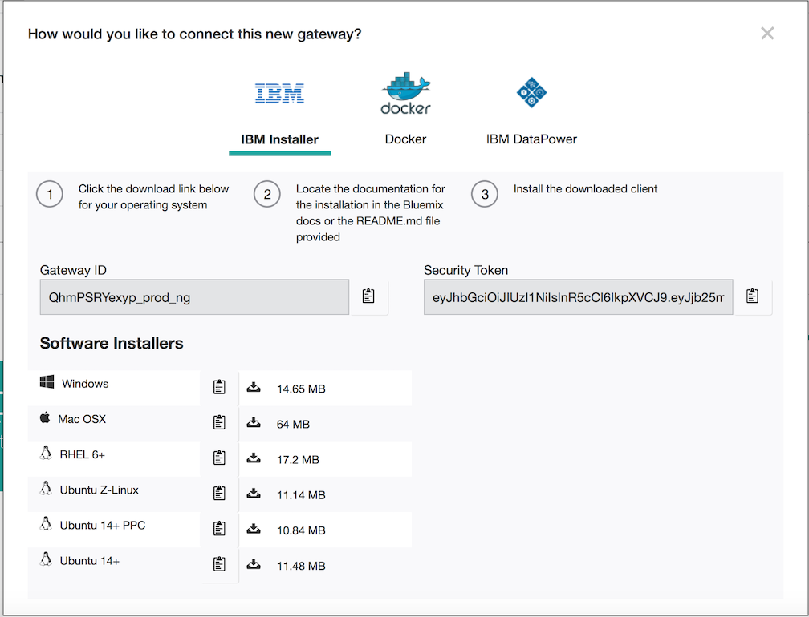
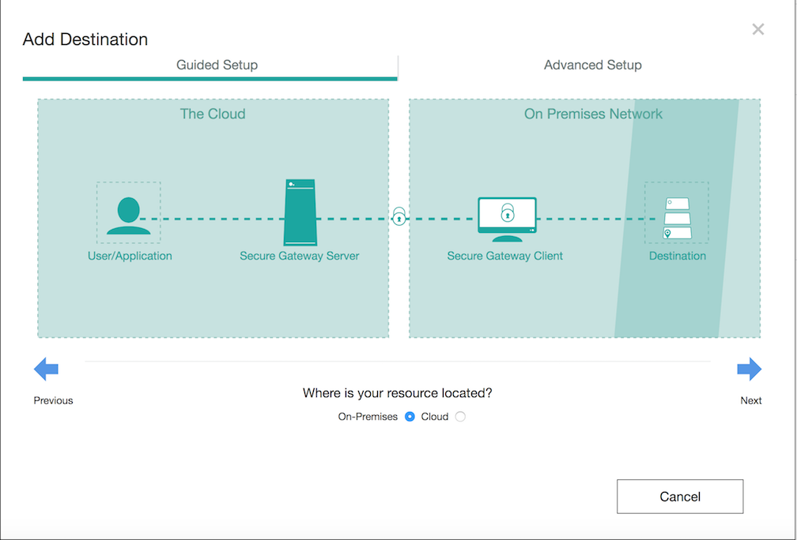
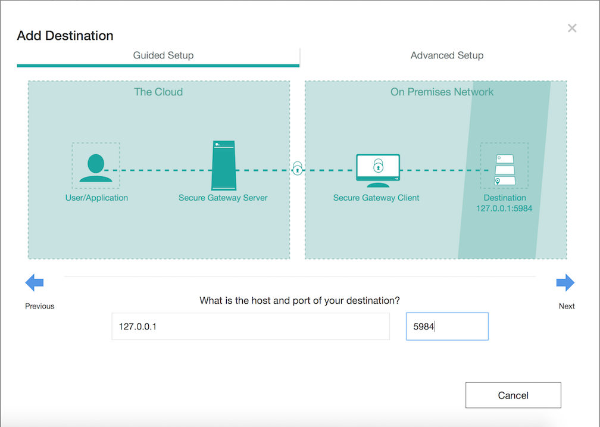

# Publish your APIs Via API Connect using On-promise Database and Cloud Server

## Steps
1. [Create a Tunnel to expose your On-promise Database](#1-create-a-tunnel-to-expose-your-on-promise-database)
2. [Build Your Sample API Application and Publish it on Cloud](#2-build-your-sample-api-application-and-publish-it-on-cloud)


# 1. Create a Tunnel to expose your On-promise Database

In this step, we will use the secure gateway as our tunnel to expose our database to the cloud host. At the end of this step, you should able to access and call your localhost database on any device via cloud host.

1. First, we want to install [Docker CLI](https://www.docker.com/community-edition#/download) and create an on-promise database using Docker. For this example, we will run the following commands to use the community's CouchDB Docker image.
    
    ```bash
    docker pull couchdb:latest
    docker run -p 5984:5984 couchdb
    ```
    
    Then, initiate couchDB with the following script.
    
    ```bash
    bash database_init.sh
    ```

2. Create your [secure gateway service](https://console.ng.bluemix.net/catalog/services/secure-gateway?taxonomyNavigation=apis) from bluemix.


3. Then, follow this [Getting started with the Secure Gateway](https://console.ng.bluemix.net/docs/services/SecureGateway/secure_gateway.html) tutorial to setup your gateway.

4. When you setup your secure gateway client, install **IBM Installer** and run it on your local machine.

    
    
5. After you open the secure gateway client with your Gateway ID and Security Token, click enter and run the following commands.

    ```
    acl allow 127.0.0.1:5984
    ```

    Now your Gateway is able to access your API Discovery Server.

6. Now let's create the destination for our gateway. First, select **On-Premises** at Guided Setup and click next. 

    
    
7. Next, put down **127.0.0.1** for your resource hostname and **5984** for your port and click next.

    
    
8. Next, select **TCP** for your protocol and click next. Then, select **None** for your authentication and click next. Then, do not put anything on your IP table rules. Lastly, name your destination and click **Add Destination**.


9. Now, you can access your API Discovery Server via the secure gateway cloud host. You can view your cloud host by clicking on the **gear icon** on your destination. 

    


10. Now, go to `http://<Cloud Host:Port>/` and varify the secure gateway is working and the database is accessable. Now mark down your cloud host and port because we need to change our application's database address to the cloud host.


# 2. Build Your Sample API Application and Publish it on Cloud

Our sample API application is an airline booking application that demonstrates how API application can store its data using on-promise database and enhance its API features using Bluemix's Data Analytic Service.

In this step, we will add our own Weather API credential for our application and build our own .war file using Maven.

1. First, install [Maven](https://maven.apache.org/install.html) to build and package our application into *.war* format.


2. Create your [Weather API service](https://console.ng.bluemix.net/catalog/services/weather-company-data?taxonomyNavigation=data). The Weather API can provide the airport location and weather condition for clients. 


3. Go to your **Service credentials** and mark down your username and password. Then go to **flight-booking/src/main/java/microservices/api/sample** folder (`cd flight-booking/src/main/java/microservices/api/sample`). Now, add your username and password credential in the **DatabaseAccess.java** file.

    
    
4. You also need to change the database address to your cloud host:port. (e.g. `DATABASE_CORE_ADDRESS = "http://cap-sg-prd-4.integration.ibmcloud.com:17638/";`


5. Now go back to the **flight-booking** folder, run `mvn package` to build your .war file.


6. Then go to the **deployment_artifacts** folder and move your **airlines.war** file to your main directory's **airline_app/apps** folder.

7. Now, you can go back to the main directory and push your app to the cloud. For this example, we will push our app to the IBM Cloud Foundry. So we need to install the [Cloud Foundry CLI](https://docs.cloudfoundry.org/cf-cli/install-go-cli.html).

8. Use the following commands to login to Cloud Foundry and push your application to the cloud.

    >Note: Replace <app_name> with an unique application name within your Bluemix region. This application name is the name of your API container.
    
    ```bash
    cf login -a https://api.ng.bluemix.net
    cf push <app_name> -p airline_app
    ```
    
9. To reach the API Discovery user interface, go to https://<app_name>.mybluemix.net/ibm/api/explorer. Then, use the credentials from your server.xml to login (For this example, the **username** is `admin` and the **password** is `admin`).
    
    You should see something like this in your API Discovery user interface.
    
    
    
10. As shown in the following screen capture, you can click the **Try it out** button, which starts your application, running on Docker

    
    
Now go back to the main README and continue with [step 4](https://github.com/IBM/hybrid-connectivity#4-create-an-api-connect-service-in-bluemix).
